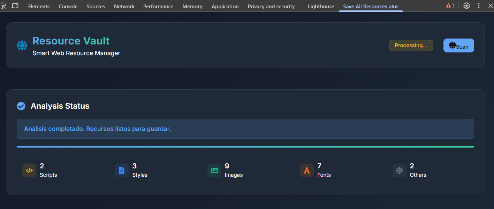
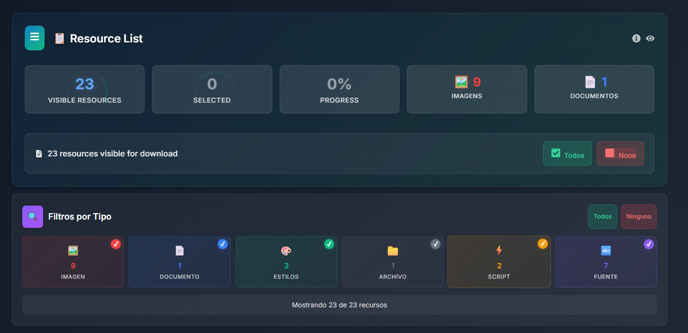

# Save All Resources plus (Chrome)

---

## 🚀 Download complete websites in seconds and keep everything organized

Are you a developer, designer, archivist, or just want to save a website to study or migrate it? Save All Resources plus is the ultimate tool for you:

- **Save time:** Download all resources from a website with a single click.
- **Stay organized:** Preserve the original folder and file structure.
- **Easy to use:** Visual interface integrated into Chrome DevTools.
- **Ideal for backups, migrations, analysis, and learning.**

### Use Cases

- Back up websites before updating or migrating them.
- Analyze how modern pages work offline.
- Create reference copies for design, development, or auditing.
- Save educational or research resources.

> **Stop wasting time downloading files one by one! Try Save All Resources plus and take your productivity to the next level.**

[⭐ Visit the repository and give it a star](https://github.com/cristopher-dev/save-all-resources-plus)

---

<!-- Featured visual example at the top -->

#### 1. Load the extension in Chrome



#### 2. Select the `unpacked2x` folder


#### 3. Use the ResourceSaver tab in DevTools



Save All Resources plus is a Google Chrome extension that allows you to download all resources from a web page (HTML, CSS, JS, images, fonts, etc.) with a single click, preserving the site's original folder structure. It's ideal for developers, archivists, designers, and anyone who needs to save complete websites easily, in an organized way, and ready to be re-hosted or analyzed offline.

## What does this project do?

- Downloads all files and resources from the current web page, including static and dynamic files.
- Maintains the folder and path structure as on the remote server.
- Allows you to save complete websites for analysis, backup, or migration.
- Integrates a custom tab in Chrome DevTools to control resource downloading.
- Lets you re-host the downloaded site on any local or remote HTTP server.

## Main Features

- Resource download: HTML, CSS, JS, images, fonts, videos, and any other referenced file.
- Preservation of folder and path structure.
- Visual interface integrated into Chrome DevTools.
- Mass download button with a single click.
- Log and preview of downloaded resources.
- Compatible with most modern websites.

## Requirements

- Google Chrome (recent version recommended)
- Node.js (version specified in the project's `.nvmrc` file)
- Yarn (package manager, install with `npm install -g yarn` if you don't have it)
- "Developer Mode" permissions enabled in Chrome to load unpublished extensions

## Quick Installation and Usage

1. Clone this repository: [Save All Resources plus](https://github.com/cristopher-dev/save-all-resources-plus)
2. Install dependencies by running `yarn` in the project root.
3. Build the extension with `yarn build` (files will be generated in the `unpacked2x` folder).
4. Open Chrome and go to `chrome://extensions/`.
5. Enable "Developer Mode".
6. Click on "Load unpacked" and select the `unpacked2x` folder.
7. Open Chrome DevTools and select the `ResourceSaver` tab.
8. Click the button to save all resources from the current page.

---

## 🛠️ Building the project

To build the extension and have it ready to use in Chrome:

1. Open a terminal in the project root.
2. Install dependencies by running:

   ```bash
   yarn
   ```

3. Build the extension with:

   ```bash
   yarn build
   ```

   This will generate all necessary files in the `unpacked2x` folder.

---

## 🧩 How to load the extension in Google Chrome

1. Open Google Chrome and go to `chrome://extensions/`.
2. Enable **Developer Mode** (top right corner).
3. Click the **Load unpacked** button.
4. Select the `unpacked2x` folder generated after building.
5. The extension will appear in the list and will be ready to use.
6. Open Chrome DevTools (F12 or Ctrl+Shift+I) and select the `ResourceSaver` tab to start downloading resources.

---

## Development

- Requires Node.js (version specified in `.nvmrc`)
- Install dependencies with `yarn`
- Build with `yarn build`

---

Author: Cristopher Martinez
Repository: [Save All Resources plus](https://github.com/cristopher-dev/save-all-resources-plus)
